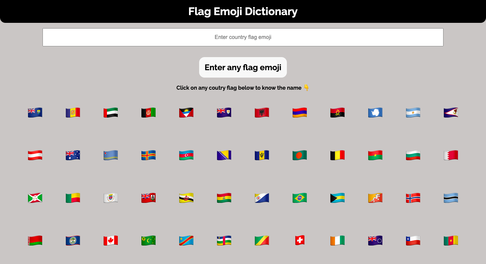

# Flag Emoji Dictionary

This WebApp gives you the name of the country when you click on the flag.

---

## Technologies used

- ReactJS

---

## Preview

---

## Contact

- [Portfolio](https://amansingh.netlify.app "Aman's Portfolio")
- <a href="mailto: reachout.amansingh@gmail.com">Mail</a>
- [Twitter](https://twitter.com/aman11s "Aman's Twitter")
- [LinkedIn](https://linkedin.com/in/aman11s "Aman's LinkedIn")

---

### If you like this repository please give a ⭐ in the top right corner. 😊
